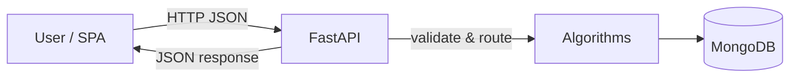

# QGENOME — Documentation (Overview)

## 1. High-Level Overview
- Problem: Interactive DNA sequence analysis (alignment, motif discovery, variant scoring) and HMM decoding using classical and quantum-style (Qiskit Aer) methods.
- Target users: Computational biologists, bioinformatics engineers, researchers, students.
- Type: Full-stack system — API backend (FastAPI), Algorithms (Python/NumPy/hmmlearn/Qiskit), Web UI (React), CLI tools, MongoDB persistence.
- Real-world use cases:
	- Compare classical vs quantum-style HMM decoding on gene-like sequences.
	- Run global/local alignment and visualize matches.
	- Discover short motifs across multiple sequences.
	- Score variant “pathogenicity” with interpretable features.

## 2. Architecture Summary
- Style: Layered monolith.
- Components:
	- UI (React): Calls API, renders charts/3D.
	- API (FastAPI): Validation, routing, orchestration.
	- Services/Algorithms: DP alignment, HMM Viterbi, PWM motif, QCNN-inspired variant.
	- Database (MongoDB): Runs, datasets, jobs.

## 3. System Flow (IN → PROCESS → OUT)
- Inputs: HTTP JSON (sequences, params), env vars (.env), MongoDB documents.
- Process: Validate → Create job → Run algorithm → Save run → Update job → Build response.
- Outputs: JSON results (scores, decoded paths, metrics), persisted records.
- Error handling: 400 for invalid inputs; 500 for unexpected errors; job status marked failed on exception.

## 4. Simple System Flow Diagram

## 5. Beginner Friendly Summary
- Paste DNA letters (A/C/G/T) into the web app.
- Click a button (align, decode, find motif). The server checks inputs, runs math/algorithms, saves results.
- You see scores, decoded paths, charts, and 3D visuals. If inputs are invalid or too long, you’ll get a clear error.

See also: detailed guides in this folder (architecture, data flow, algorithms, API, testing, etc.).
