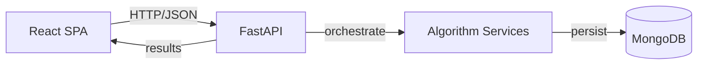

# Architecture

## Overall Architecture
- Style: Layered monolith
  - UI (React + Vite)
  - API (FastAPI + Pydantic)
  - Services/Algorithms (Python/NumPy/hmmlearn/Qiskit)
  - Database (MongoDB via Motor)

## Folder Structure & Responsibilities
- backend/
  - main.py — API routes, validation, orchestration
  - models.py — Pydantic models/enums (datasets, jobs, statuses)
  - db.py — sequence_runs collection + connection lifecycle
  - mongo_operations.py — datasets & processing_jobs CRUD
  - vqe_alignment.py — global alignment (Needleman–Wunsch-like)
  - smith_waterman.py — local alignment + BLAST-like
  - hmm_models.py — HMM configs & helpers
  - classical_viterbi.py — hmmlearn-based Viterbi
  - qva_viterbi.py — Qiskit Aer quantum-style Viterbi
  - qaoa_motif.py — PWM motif finder
  - qcnn_variant.py — QCNN-inspired variant scoring
  - processing_logger.py — step-wise job logging
  - visualizations.py — helix/circuit/alignment viz data
- frontend/
  - src/App.jsx — SPA, calls API, renders charts/3D
  - components/* — UI building blocks
- docs/ — This documentation set

## Entry Point & Execution Flow
- Backend: `uvicorn backend.main:app` (startup connects to Mongo; shutdown closes it).
- Frontend: `npm run dev` (Vite) calling API at `http://localhost:8000`.

## Component Communication
- React SPA → FastAPI via `fetch` JSON.
- FastAPI → Algorithms via in-process Python calls.
- FastAPI ↔ MongoDB via Motor (async), using Pydantic models for IO.

## Architecture Diagram

