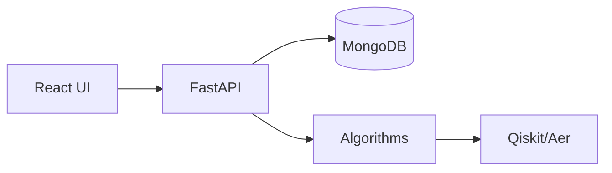

# Technology & Tools

## Backend
- FastAPI + Pydantic for HTTP and validation.
- Motor (async PyMongo) for MongoDB.
- NumPy for DP; hmmlearn or custom for HMM utilities.
- Qiskit + Aer simulator for quantum-inspired routines.

## Frontend
- React 18 + Vite for SPA.
- Chart.js for metrics; Three.js for 3D helix.

## Dev & Ops
- Python 3.10+; Node 18+.
- `backend/requirements.txt` for Python deps; `frontend/package.json` for JS deps.
- Environment via `.env` (Mongo URI, DB name, feature flags).

## Patterns
- Strategy for algorithm selection.
- Repository-like layer for Mongo operations.
- DTOs via Pydantic models.

## Diagrams

